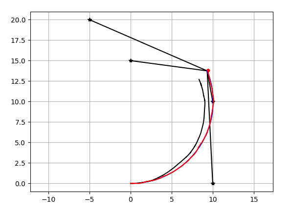
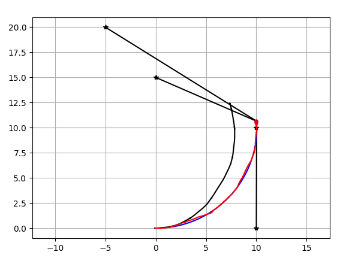

# ensemble_kalman_filter  
~~~
python ensemble_kalman_filter.py
~~~
## Result  
Ensemble kalman filter(Number of Particle=20)   
  
As the references,[particle filter](https://github.com/AtsushiSakai/PythonRobotics/tree/master/Localization/particle_filter)(Number of Particle=20)    
 
## Reference  
katayama,"Non-linearity Kalman Filter",2011,p121-p140(in Japanse)  
[PythonRobotics Particle Filter](https://github.com/AtsushiSakai/PythonRobotics/tree/master/Localization/particle_filter)  

